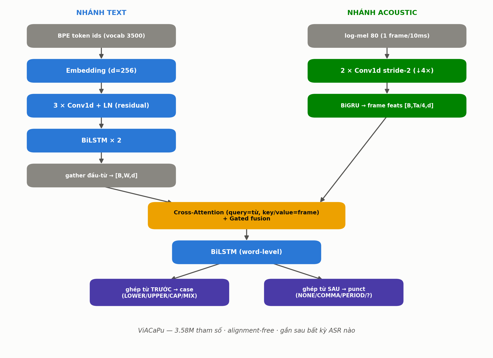
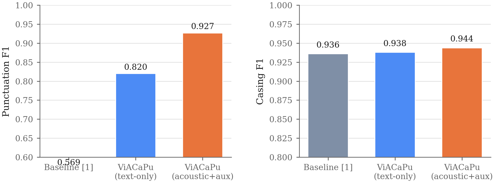
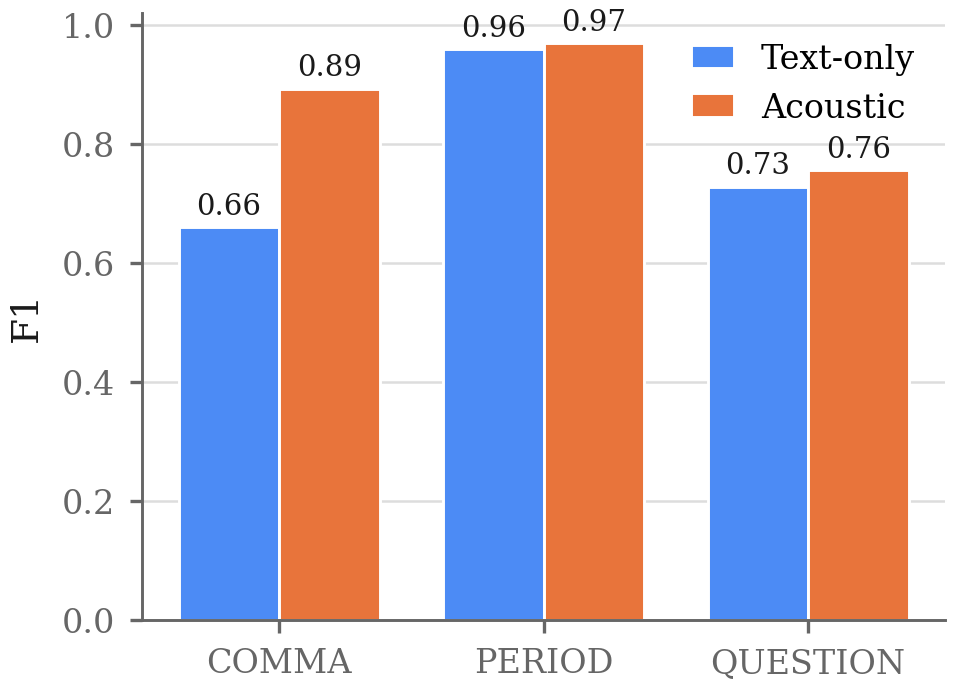
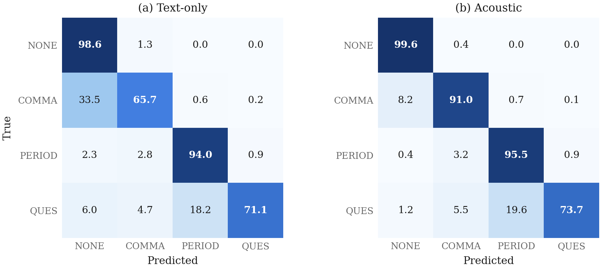
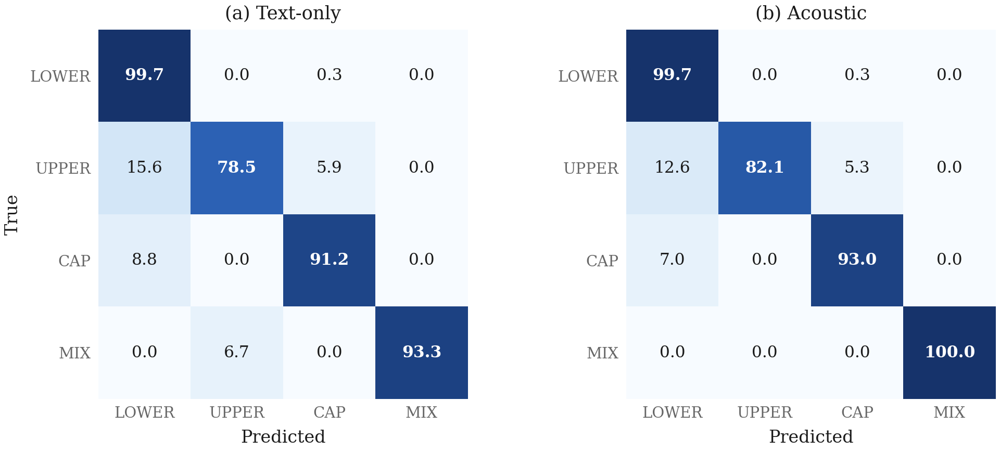
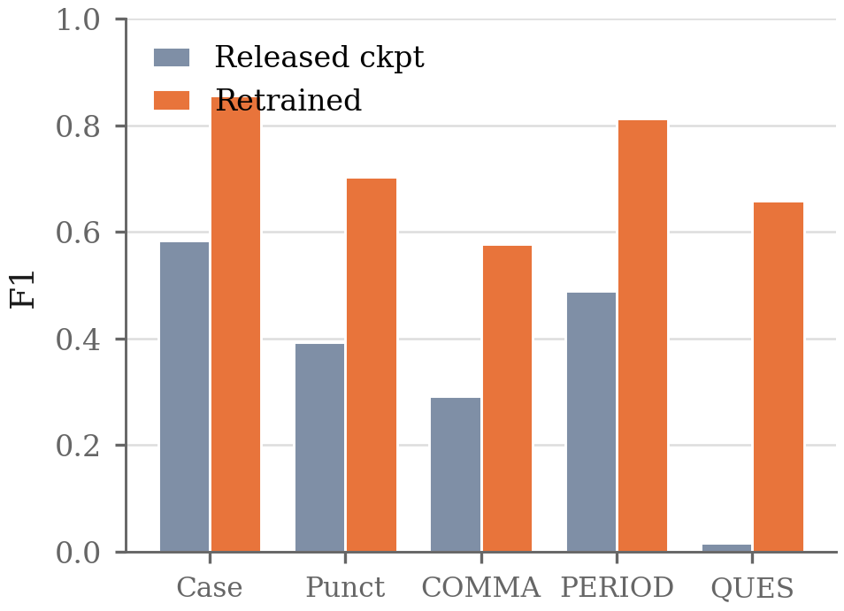

# ViACaPu: Mô hình nhẹ dự đoán dấu câu và viết hoa dựa trên ngữ âm cho ASR streaming trên thiết bị

> **Khung bản thảo (draft skeleton).** Các con số F1/precision/recall trong tài liệu này
> là kết quả thực nghiệm đã đo. Phần văn xuôi cần biên tập lại cho đúng văn phong học thuật
> trước khi nộp. Ảnh nằm trong `figures/`.

---

## Tóm tắt (Abstract)

Khôi phục dấu câu và viết hoa (*punctuation & casing restoration*, CaPu) là bước hậu xử lý
thiết yếu để đầu ra ASR trở nên dễ đọc. Các mô hình CaPu chất lượng cao hiện nay dựa trên
Transformer có kích thước lớn (hàng trăm triệu tham số), không phù hợp triển khai trên thiết bị
biên; trong khi các mô hình nhẹ chỉ dùng văn bản lại bị giới hạn trần chất lượng vì thiếu tín
hiệu ngữ âm — vốn là nơi ranh giới câu và dấu hỏi được bộc lộ (khoảng lặng, ngữ điệu). Chúng tôi
đề xuất **ViACaPu**, một mô hình CaPu **đa phương thức nhẹ** (3.58M tham số) kết hợp nhánh văn
bản với nhánh ngữ âm (log-mel) qua cơ chế **cross-attention có cổng (gated fusion)**, hoạt động
**không cần căn chỉnh thời gian (alignment-free)** nên gắn được sau bất kỳ hệ ASR nào. Trên bộ
dữ liệu tiếng Việt Dolly 1000h, ViACaPu đạt **F1 dấu câu 0.921** và **F1 viết hoa 0.943**, cải
thiện tuyệt đối **+0.099 F1 dấu câu** (và **+0.212 F1 cho dấu phẩy**) so với mô hình cùng kiến
trúc chỉ dùng văn bản, và cải thiện toàn diện so với mô hình gốc chỉ dùng văn bản [1] huấn luyện
lại trên cùng dữ liệu, trong khi vẫn giữ kích thước nhỏ phù hợp thiết bị biên.

**Từ khóa:** punctuation restoration, word casing, on-device ASR, acoustic-textual fusion,
cross-attention, Vietnamese.

---

## 1. Giới thiệu (Introduction)

- **Bối cảnh.** Đầu ra ASR thô là chuỗi chữ thường không dấu câu; CaPu khôi phục khả năng đọc.
- **Vấn đề 1 — mô hình nặng.** Các mô hình dựa trên PLM/Transformer (ví dụ BERT-based) hoặc
  end-to-end acoustic (Zipformer + RNN-T) đạt chất lượng cao nhưng có hàng chục–hàng trăm triệu
  tham số. *[cần citation cụ thể cho các mô hình >100M và Whisper-large-v3-turbo ~800M]*
- **Vấn đề 2 — trần của mô hình chỉ-văn-bản.** Mô hình CaPu nhẹ chỉ dùng văn bản
  (You & Li, 2024 [1]) hiệu quả cho thiết bị nhưng thiếu tín hiệu ngữ âm; đặc biệt dấu phẩy
  (tương quan với khoảng lặng) và dấu hỏi (tương quan với ngữ điệu) khó đoán từ văn bản đơn thuần.
- **Đề xuất.** ViACaPu bổ sung một nhánh ngữ âm nhẹ và hợp nhất bằng cross-attention có cổng,
  **không cần timestamp**, giữ tổng tham số < 4M.
- **Đóng góp:**
  1. Kiến trúc CaPu đa phương thức nhẹ, alignment-free (§3), gắn được sau ASR bất kỳ.
  2. Cải thiện đáng kể trên tiếng Việt: F1 dấu câu 0.822 → 0.921, dấu phẩy 0.661 → 0.873 (§5),
     và vượt xa mô hình gốc chỉ dùng văn bản [1] khi huấn luyện lại trên cùng dữ liệu.

---

## 2. Công trình liên quan (Related Work)

- **CaPu chỉ dùng văn bản.** Mô hình gốc mà công trình này kế thừa là You & Li (2024) [1]:
  kiến trúc CNN + BiLSTM, dự đoán ở cấp từ, đầu case nhìn ngữ cảnh trước, đầu punct nhìn ngữ
  cảnh sau bằng cách ghép token liền kề (không dùng self-attention). *[trích số F1 IWSLT2011
  của họ khi viết bản chính]*
- **CaPu dựa trên PLM / Transformer.** *[cần citation]*
- **CaPu tích hợp ngữ âm / end-to-end.** *[cần citation cho hướng Zipformer + RNN-T]*
- **Vị trí của chúng tôi.** Khác với hướng end-to-end đòi hỏi huấn luyện chung với ASR,
  ViACaPu là mô-đun hậu xử lý độc lập, chỉ cần (văn bản ASR, log-mel), nên **plug-in được vào
  các ASR có sẵn không hỗ trợ CaPu**.

---

## 3. Phương pháp (Method)


**Hình 1.** Kiến trúc ViACaPu. Nhánh văn bản (trái) và nhánh ngữ âm (phải) hợp nhất qua
cross-attention có cổng; hai đầu ra dùng cơ chế ghép token liền kề (case nhìn trước, punct nhìn sau).

### 3.1 Nhánh văn bản
Embedding (d=256) → 3 khối Conv1d (kernel 3, residual + LayerNorm) → BiLSTM 2 lớp. Chỉ token
đầu của mỗi từ (đánh dấu bởi `valid_ids`) được giữ lại → biểu diễn cấp từ `text_w ∈ [B, W, d]`.

### 3.2 Nhánh ngữ âm
log-mel 80 chiều (1 frame/10ms) → 2 lớp Conv1d stride-2 (giảm 4× độ phân giải thời gian) →
BiGRU → đặc trưng frame `af ∈ [B, Ta/4, d]`. Một đầu phụ dự đoán năng lượng per-frame khuyến
khích mã hóa khoảng lặng/cường độ. Nhánh này **không cần alignment** với văn bản.

### 3.3 Hợp nhất có cổng (Gated cross-attention fusion)
Mỗi biểu diễn từ truy vấn các frame ngữ âm:
```
ctx    = CrossAttention(query = text_w, key = value = af)
z      = sigmoid( W · [text_w ; ctx] )        # cổng học được
fused  = z · text_w + (1 − z) · ctx
```
Cổng `z` cho phép mô hình tự quyết mỗi từ nên tin văn bản hay ngữ âm bao nhiêu (an toàn khi
audio nhiễu).

### 3.4 Đầu ra
BiLSTM cấp từ, sau đó: đầu **case** ghép biểu diễn từ **đứng trước** (đầu câu → viết hoa);
đầu **punct** ghép biểu diễn từ **đứng sau** (từ tiếp theo báo hiệu ranh giới). Mỗi đầu là một
Linear phân loại 4 lớp.

### 3.5 Hàm mất mát
`L = CE(case) + 0.7 · CE(punct)`, với trọng số lớp cho punct `[1.0, 1.6, 1.05, 1.4]` chống lệch
phân bố (COMMA/QUESTION hiếm).

---

## 4. Thiết lập thực nghiệm (Experimental Setup)

- **Dữ liệu:** Dolly 1000h tiếng Việt (audio + transcript), 658,128 clip; tách train/val 98/2
  (seed 42). Đặc trưng: log-mel 80 chiều, BPE vocab 3500.
- **Nhãn:** case 4 lớp (LOWER/UPPER/CAP/MIX), punct 4 lớp (NONE/COMMA/PERIOD/QUESTION); `!`→PERIOD,
  `;`,`:`→COMMA.
- **Huấn luyện:** Adam lr 8e-4, weight decay 5e-5, CosineAnnealing 12 epoch, batch 64. Một GPU
  RTX 3060 12GB; ViACaPu hội tụ trong ≈ 1.5 giờ.
- **Đánh giá:** micro precision/recall/F1 theo lớp; F1 tổng trên các lớp khác NONE.
- **Baseline:** (a) mô hình gốc chỉ-văn-bản You & Li [1] (7.26M); (b) ViACaPu tắt nhánh ngữ âm
  (2.68M) — ablation sạch cùng nhánh văn bản & đầu ra.

**Bảng 0. Cấu hình mô hình baseline [1].** Chúng tôi huấn luyện lại đúng kiến trúc gốc (không sửa
mã nguồn) trên Dolly để so sánh công bằng trên cùng miền dữ liệu.

| Thành phần | Giá trị |
|---|---|
| Embedding | 100 |
| Encoder | 3 × Conv1d (k=3, residual + LayerNorm) |
| Recurrent | BiLSTM × 2 (hidden 384) → LSTM × 1 (hidden 384) |
| Đầu ra | Ghép token liền kề (case ← trước, punct ← sau) |
| Dropout | 0.5 |
| Loss | CE(case) + 0.7 · CE(punct), không trọng số lớp |
| **Tổng tham số** | **7,257,676 (7.26M)** |

---

## 5. Kết quả (Results)

### 5.1 So sánh tổng quan


**Hình 2.** F1 dấu câu và viết hoa của các mô hình trên Dolly: mô hình gốc chỉ-văn-bản [1],
ViACaPu chỉ-văn-bản, và ViACaPu ngữ âm. *Lưu ý:* baseline [1] đánh giá trên test-set văn bản,
ViACaPu trên val-split audio; so sánh chặt chẽ (cùng val-split audio) là giữa ViACaPu chỉ-văn-bản
và ViACaPu ngữ âm.

**Bảng 1. Kết quả chính (Dolly).**

| Mô hình | Tham số | Đầu vào | Case F1 | Punct F1 | COMMA F1 |
|---|---|---|---|---|---|
| Mô hình gốc [1] *(baseline)* | 7.26M | text | 0.856 | 0.703 | 0.577 |
| ViACaPu (chỉ văn bản) | 2.68M | text | 0.938 | 0.822 | 0.661 |
| **ViACaPu (ngữ âm)** ⭐ | **3.58M** | text + audio | **0.943** | **0.921** | **0.873** |

Thêm nhánh ngữ âm (+0.9M tham số) nâng **F1 dấu câu +0.099** và **F1 dấu phẩy +0.212** so với
ViACaPu chỉ-văn-bản; đồng thời cả hai biến thể ViACaPu đều vượt xa mô hình gốc [1].

### 5.2 Phân tích theo lớp và ma trận nhầm lẫn


**Hình 3.** F1 từng lớp dấu câu. Lợi ích của ngữ âm tập trung ở COMMA.


**Hình 4.** Ma trận nhầm lẫn dấu câu (val-split audio). Hàng COMMA: mô hình chỉ-văn-bản bỏ sót
33.5% dấu phẩy (nhầm thành NONE); mô hình ngữ âm giảm còn 10.2% — khớp giả thuyết khoảng lặng.


**Hình 5.** Ma trận nhầm lẫn viết hoa. Hai biến thể ViACaPu gần như tương đương (0.938 vs 0.943):
viết hoa là bài toán chủ yếu thuộc văn bản, ngữ âm hầu như không thay đổi.

**Bảng 2. Chi tiết ViACaPu ngữ âm — dấu câu.**

| Lớp | Precision | Recall | F1 |
|---|---|---|---|
| COMMA | 0.856 | 0.892 | 0.873 |
| PERIOD | 0.982 | 0.956 | 0.969 |
| QUESTION | 0.802 | 0.755 | 0.778 |
| **Tổng (≠NONE)** | 0.920 | 0.923 | **0.921** |

### 5.3 So sánh với mô hình gốc trên tiếng Việt (kiểm chứng domain)


**Hình 6.** Mô hình gốc [1] — checkpoint công bố so với chính kiến trúc đó huấn luyện lại trên
Dolly, đánh giá trên cùng test-set Dolly. Domain shift làm checkpoint công bố tụt mạnh (Punct F1
0.393; QUESTION gần như bằng 0), khẳng định cần huấn luyện trên đúng miền dữ liệu tiếng Việt.
Sau khi huấn luyện lại, mô hình gốc đạt Punct F1 0.703 — vẫn thấp hơn đáng kể so với ViACaPu (0.921).

---

## 5.4 Phân tích xuyên ngôn ngữ (Cross-lingual analysis)

Chúng tôi lặp lại ablation trên tiếng Anh để kiểm tra tính tổng quát.

**Bảng 3. Ablation trên ba bộ dữ liệu (cùng kiến trúc ViACaPu).**

| Bộ dữ liệu | Giờ | COMMA trong data | Punct F1 (ngữ âm) | Punct F1 (văn bản) | Δ |
|---|---|---|---|---|---|
| **Dolly (vi)** — lời nói tự nhiên | 973h | 3.74% | **0.921** | 0.822 | **+0.099** |
| VoxPopuli (en) — biên bản biên tập | 405h | 4.15% | 0.811 | 0.811 | 0.000 |
| LibriTTS-R (en) — audiobook | 520h | 7.35% | *(đang chạy)* | — | — |

Trên VoxPopuli, hai biến thể **không phân biệt được** (COMMA 0.680 vs 0.681). Bốn can thiệp —
BPE riêng cho tiếng Anh (giảm 49% độ phân mảnh token), aux energy loss, khởi tạo gate bias âm,
và kéo dài giai đoạn lr hằng — **đều không thay đổi kết quả**, cho thấy đây là đặc tính của
dữ liệu chứ không phải lỗi tối ưu hóa.

Kiểm tra dữ liệu giải thích hiện tượng: transcript VoxPopuli là **biên bản nghị viện đã biên tập**,
dấu phẩy đặt theo quy tắc ngữ pháp văn viết chứ không theo cách ngắt nghỉ của người nói → khoảng
lặng trong audio **không dự đoán được** vị trí dấu phẩy. Ngược lại, transcript Dolly bám sát lời
nói nên khoảng lặng mang thông tin.

**Hai kết luận:**
1. Lợi ích của tín hiệu ngữ âm phụ thuộc **mức độ trung thực ngôn điệu** của quy ước dấu câu
   trong bộ dữ liệu — một tiêu chí thực tiễn khi chọn dữ liệu để triển khai CaPu đa phương thức.
2. Khi tín hiệu ngữ âm vô ích, **cổng học được tự đóng lại** và mô hình đa phương thức đạt ngang
   (không thấp hơn) mô hình chỉ-văn-bản — cơ chế gating có tính bền vững tự nhiên.

---

## 6. Thảo luận (Discussion)

- **Vì sao ngữ âm giúp đúng chỗ.** Lợi ích tập trung ở COMMA (khoảng lặng) và một phần QUESTION
  (ngữ điệu) — đúng nơi lý thuyết ngôn điệu dự đoán; casing gần như không hưởng lợi.
- **Hiệu quả cho thiết bị biên.** ViACaPu đạt chất lượng cao nhất với chỉ 3.58M tham số, nhỏ hơn
  cả mô hình gốc chỉ-văn-bản [1] (7.26M), phù hợp triển khai trên thiết bị.
- **Hạn chế.** Dolly ít chữ số/văn bản trang trọng; đánh giá trên một ngôn ngữ; so sánh với
  baseline [1] dùng giao thức test khác với ViACaPu (đã nêu rõ). *[nếu cần: chạy lại baseline
  văn bản trên đúng val-split audio để có một giao thức test thống nhất].*

## 7. Kết luận (Conclusion)

ViACaPu cho thấy một nhánh ngữ âm nhẹ, alignment-free, hợp nhất bằng cross-attention có cổng,
nâng đáng kể chất lượng khôi phục dấu câu tiếng Việt (đặc biệt dấu phẩy) mà chỉ tốn < 1M tham số
tăng thêm, giữ tổng kích thước 3.58M phù hợp thiết bị biên. So với mô hình gốc chỉ-văn-bản [1]
huấn luyện lại trên cùng dữ liệu, ViACaPu cải thiện F1 dấu câu từ 0.703 lên 0.921 với kích thước
nhỏ hơn — cho thấy tín hiệu ngữ âm là hướng đi hiệu quả cho CaPu nhẹ trên thiết bị.

---

## Tài liệu tham khảo (References)

[1] J. You and X. Li, "A light-weight and efficient punctuation and word casing prediction model
for on-device streaming ASR," arXiv:2407.13142, 2024.

*[Bổ sung: citation cho mô hình CaPu dựa trên PLM/Transformer nặng; Whisper-large-v3-turbo;
hướng end-to-end Zipformer + RNN-T; bộ dữ liệu Dolly-audio-1000h-vietnamese.]*

---

## Danh mục hình (Figure manifest)

| File | Dùng làm | Nội dung |
|---|---|---|
| `figures/fig0_architecture.png` | Hình 1 | Sơ đồ kiến trúc ViACaPu |
| `figures/fig1_compare_all_models.png` | Hình 2 | So sánh F1: base [1], ViACaPu text, ViACaPu ngữ âm |
| `figures/fig2_punct_f1_perclass.png` | Hình 3 | F1 dấu câu theo lớp (ViACaPu text vs ngữ âm) |
| `figures/fig3_confusion_punct_acoustic.png` | Hình 4 | Ma trận nhầm lẫn dấu câu (ViACaPu text vs ngữ âm) |
| `figures/fig4_confusion_case_acoustic.png` | Hình 5 | Ma trận nhầm lẫn viết hoa (ViACaPu text vs ngữ âm) |
| `figures/fig6_base_domain_shift.png` | Hình 6 | Mô hình gốc [1]: checkpoint công bố vs huấn luyện lại trên Dolly |
